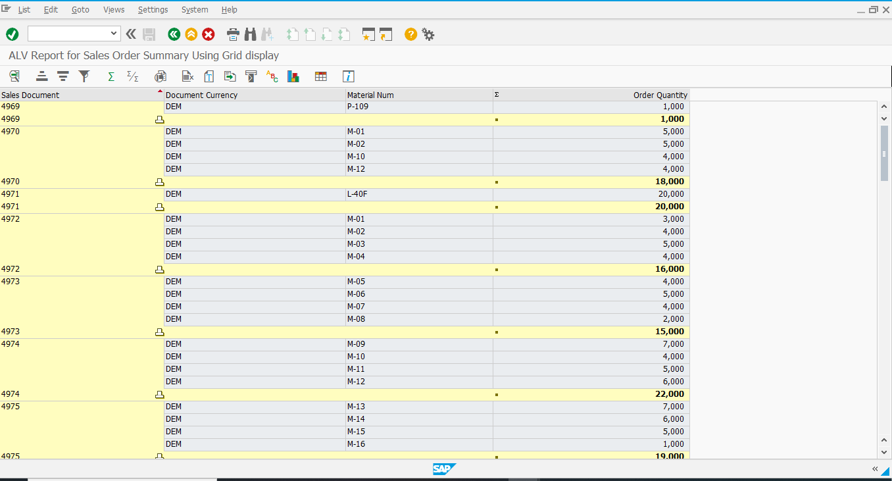
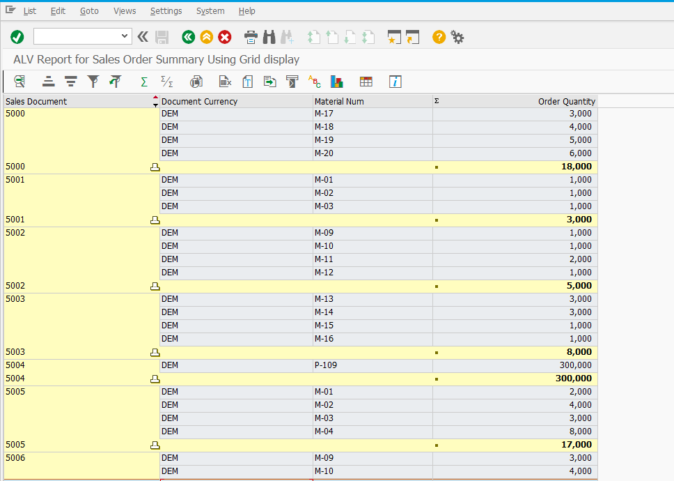

# SAP ABAP Sales Order Summary Report (ALV)

This project contains an SAP ABAP ALV report (`ZSA_ALV_REPORT_PROJECT`) to display summarized sales order data.

 Features

- ALV Grid Display using `CL_GUI_ALV_GRID`
- Filters for Sales Org, Customer, and Date Range
- Total Sales Order Value Calculation
- Sort and Filter Enabled in ALV Output

 Requirements

- SAP NetWeaver system
- Sales Order Table: `VBAK`, `VBAP`.
- Custom Selection Screen with Parameters

 How to Use

1. Create a program in `SE38`: `ZSA_ALV_REPORT_PROJECT`.
2. Paste the code from : `ZSA_ALV_REPORT_PROJECT.ABAP`.
3. Activate and execute.

1. ALV Output

2. Filtered Sales Orders

AUTHOR:
SANKIRTHANA VINDYALA
